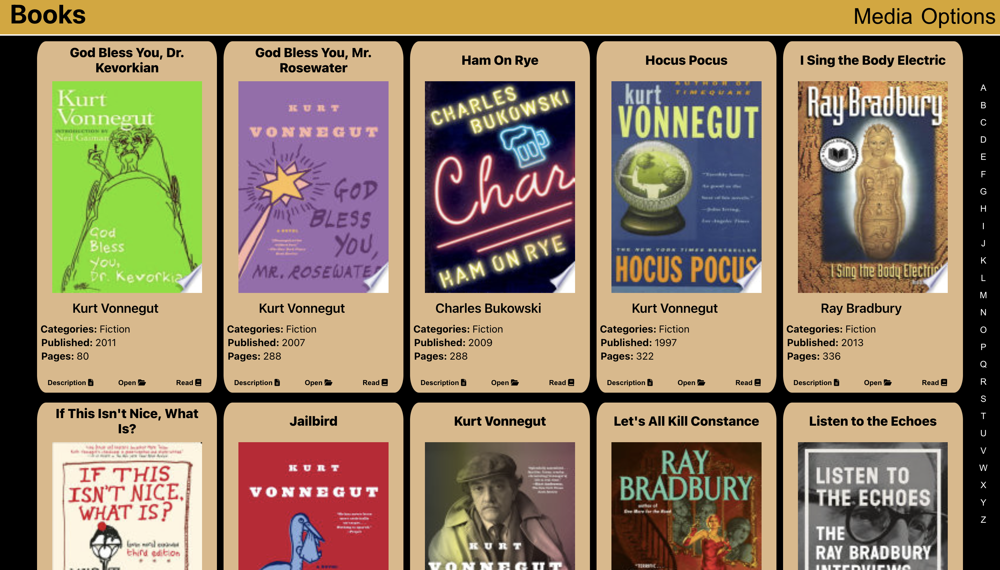
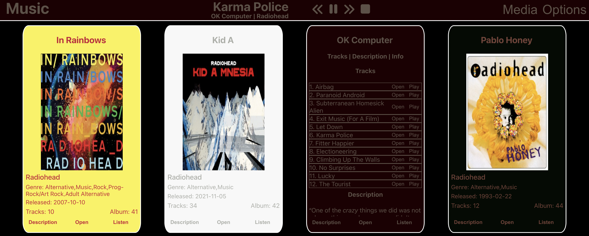
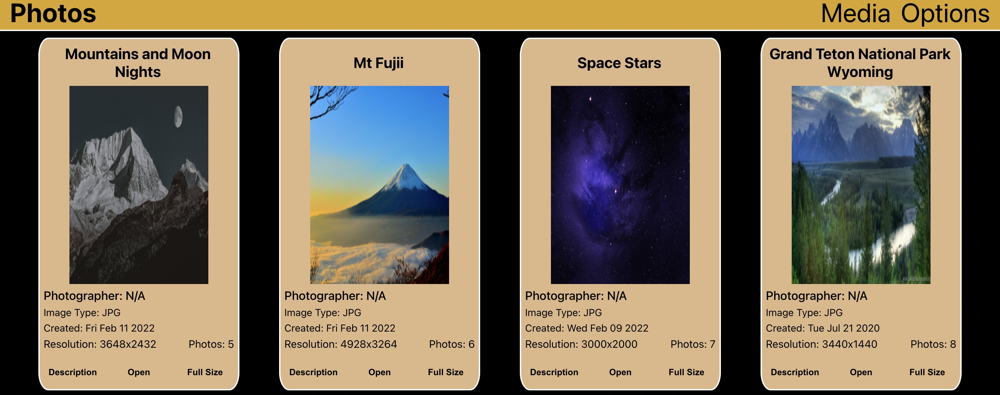

# Media Server

This project was made using NodeJS for the backend and React for the front end. One goal when writing this project was writing reusable code.
My main goal for this project was to showcase my abilities writing code and obtain a developer job.

Feedback and feature suggestions are appreciated.

See About Me section at the bottom for why I want a developer job and my skills/background in IT.
  

## Installation / Setup

<h3>Prerequisites:</h3>
<li>NodeJS - 16.14.0</li>
 
<h3>Start the Program:</h3>

Inside the App Directory Run:

`npm i`

`npm start`

Inside the App/Server Directory Run:

`npm i`

`node app.js`

 

## About Media Server

This project was designed to include all popular media types most users have downloaded to their machines and put them in a single easily accessable location with metadata information included. From one location they would be able to view, play, read, and use all media types easily.

 
<h4>Media Types Supported:<h4>
<li>Books</li>
<li>Movies</li>
<li>TV Shows</li>
<li>Music</li>
<li>Photos</li>
 
<h3>Metadata:</h3>

This project obtains metadata from multiple API sources.

<h4>The API's used are:</h4>
<li>Books: Google Books</li>
<li>Movies and TV Shows: OMDBAPI</li>
<li>Music: Apple Music</li>
<li>Photos: N/A</li>
 
<h3>API Limitations:</h3>
<li>Books: None</li>
<li>Movies and TV: 1000 Calls/Day</li>
<li>Music: Personal API Key Needed $99/Year Apple Developer Program</li>
<li>Photos: N/A</li>
 
<h3>Server Information:</h3>

The NodeJS server scans a user defined root directory for a media type. The scan will find files based on popular file extension types for that media type.

 
<h3>Current Supported File Extensions, by Media Type:</h3>
<h4>Books:</h4>
<li>.epub</li>
<li>.pdf</li>
<li>.doc</li>

<h4>Movies and TV:</h4>
<li>.mp4</li>
<li>.mkv</li>
<li>.m2ts</li>

<h4>Photos:</h4>
<li>.jpg</li>
<li>.gif</li>
<li>.png</li>
<li>.tiff</li>

<h4>Music</h4>
<li>.flac</li>
<li>.mp3</li>
<li>.m4a</li>
 
<h3>Client Information:</h3>

The client side was built using React. From the client you can play/read/view your media. View metadata information obtained from API's listed above in easily readable cards. Sort Media Types based on Name, Year, Length, etc. Open file locally if you wish to use a different program to handle the media type. View information on items not found from scan and fix metadata so they are found on the next scan.
  

## Preview Images

<h2>Books</h2>

<h2>Book Reader</h2>

<h2>Music</h2>

<h2>Movies</h2>

<h2>Watch Movie</h2>

<h2>TV Shows</h2>

<h2>Photos</h2>

<h2>Settings</h2>

## Additional Features To Be Added Soon / Known Bugs

Date: 4/20/22

<h4>Program:</h4>
<li>Performance - Include All Media Types in DB.</li>
<li>Performance - Scan Performance Improvements Based on Data Captured</li>
<li>Performance - API Calls Performance Improvements.</li>
<li>Performance - Modify/Remove CreateRows Function.</li>
<li>Design - Better Design and CSS Improvements</li>
<li>Feature - Search.</li>

<h4>Features to be added by Media Type</h4>

<h4>Books:</h4>
<li>Bug - Fix View for PDF file extension to prevent reload</li>
<li>Feature - Add Read View for DOC file extension</li>

<h4>TV Shows:</h4>
<li>Data - Transcode to support more codecs.</li>
<li>Feature - Play Single Season Episode.</li>
<li>Feature - Metadata for Single Episode.</li>
<li>Feature - Card View for Seasons/Episodes.</li>

<h4>Movies:</h4>
<li>Data - Include Year in API call for Movies and TV to prevent incorrect matches</li>
<li>Data - Transcode to support more codecs.</li>

<h4>Photos:</h4>
<li>Performance - Database for Images / Remove need for base64 encoding and sending images. </li>
<li>Data - Add File Size.</li>
<li>Data - Add more info under description.</li> 

## Features Added / Fixed Bugs

<h4>Program</h4>
<li>Finished 4/30 Performance - Add Database MongoDB or MS SQL Server</li>
<li>Finished 5/1 Data - Section for Media Not Found API Call</li>

<h4>Music:</h4>
<li>Finished 4/30 Feature - Continuous Album Playback</li>
<li>Finished 4/29 Feature - Media Player in Browser</li>
<li>Finished 4/29 Data - Include Artist in Apple Music API Call to prevent incorrect matches</li>
<li>Finished 4/29 Data/Performance - Card Based on Album w/ Songs (Currently 1 Song/Card. Will Decrease Load Times)</li>
 

## About Me

<h3>Why do I want a developer job?</h3>

<li>Grow Skillset</li>
<li>Continuous Unique Problems to Solve</li>
<li>Learn from Others</li>
<li>Utilization of Critical Thinking / Problem Solving skills</li>
<li>More Enjoyable than Systems Administration (to me)</li>
<li>Less Interruptions from Non-Technical People while Working</li>  

<h3>My Skillset / Background</h3>

My current background is in Systems Administration with experience managing Amazon Web Services such as EBS, EC2, VPC, Load Balancing, Route53, and more. I also have experience managing repositories such as merging pull requets, solving merge conflicts, and testing code before deploying to production. Other areas I have experience in include, SQL: backing up databases, restoring databases, writing reports, revewing performance indicies. Networking: Configuring VLAN's, VPN's, DNS Servers, Firewalls, etc. If there is a technical problem, I can solve it. If there there is a technical skill I don't have, I can learn it. 

 

Thank you for reading, hopefully you enjoy this program! Feedback is appreciated.

